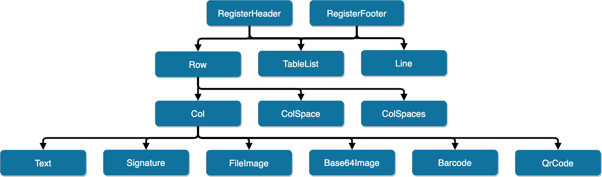
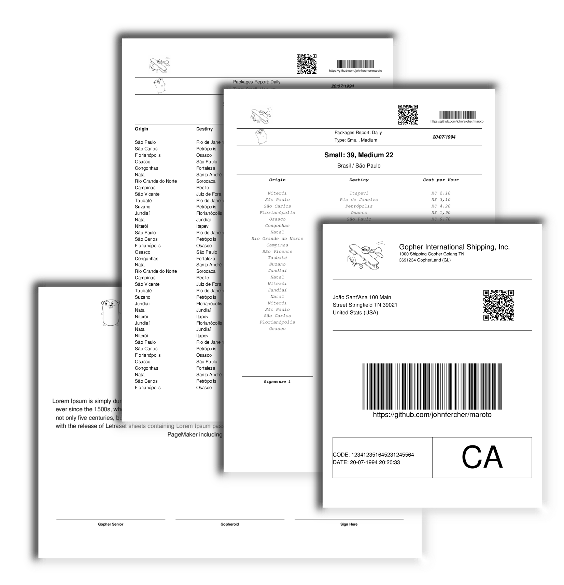

# Maroto 

[](https://godoc.org/github.com/johnfercher/maroto)
[][travis] 
[](https://codecov.io/gh/johnfercher/maroto) 
[](https://goreportcard.com/report/github.com/johnfercher/maroto)
[](https://github.com/avelino/awesome-go#template-engines)  

A Maroto way to create PDFs. Maroto is inspired in Bootstrap and uses [Gofpdf](https://github.com/jung-kurt/gofpdf). Fast and simple.

> Maroto definition: Brazilian expression, means an astute/clever/intelligent person.

You can write your PDFs like you are creating a site using Bootstrap. A Row may have many Cols, and a Col may have many components. 
Besides that, pages will be added when content may extrapolate the useful area. You can define a header which will be added
always when a new page appear, in this case, a header may have many rows, lines or tablelist. 

## Installation

* With `go get`:

```bash
go get -u github.com/johnfercher/maroto
```

## Features


#### Grid System
* [Row](https://pkg.go.dev/github.com/johnfercher/maroto/pkg/pdf?tab=doc#PdfMaroto.Row)
* [Col](https://pkg.go.dev/github.com/johnfercher/maroto/pkg/pdf?tab=doc#PdfMaroto.Col)
* [ColSpace](https://pkg.go.dev/github.com/johnfercher/maroto/pkg/pdf?tab=doc#PdfMaroto.ColSpace)
* [AddPage](https://pkg.go.dev/github.com/johnfercher/maroto/pkg/pdf?tab=doc#PdfMaroto.AddPage)

#### Components To Use Inside a Col
* [Text w/ automatic new lines](https://pkg.go.dev/github.com/johnfercher/maroto/pkg/pdf?tab=doc#PdfMaroto.Text)
* [Signature](https://pkg.go.dev/github.com/johnfercher/maroto/pkg/pdf?tab=doc#PdfMaroto.Signature)
* Image ([From file](https://pkg.go.dev/github.com/johnfercher/maroto/pkg/pdf?tab=doc#PdfMaroto.FileImage) or [Base64](https://pkg.go.dev/github.com/johnfercher/maroto/pkg/pdf?tab=doc#PdfMaroto.Base64Image))
* [QrCode](https://pkg.go.dev/github.com/johnfercher/maroto/pkg/pdf?tab=doc#PdfMaroto.QrCode)
* [Barcode](https://pkg.go.dev/github.com/johnfercher/maroto/pkg/pdf?tab=doc#PdfMaroto.Barcode)   
    
#### Components To Use Outside a Row
* [TableList](https://pkg.go.dev/github.com/johnfercher/maroto/pkg/pdf?tab=doc#PdfMaroto.TableList)
* [Line](https://pkg.go.dev/github.com/johnfercher/maroto/pkg/pdf?tab=doc#PdfMaroto.Line)
    
#### Components To Wrap Row, TableList and Line
* [RegisterHeader](https://pkg.go.dev/github.com/johnfercher/maroto/pkg/pdf?tab=doc#PdfMaroto.RegisterHeader)
* [RegisterFooter](https://pkg.go.dev/github.com/johnfercher/maroto/pkg/pdf?tab=doc#PdfMaroto.RegisterFooter)

#### Others   
* [Properties](https://pkg.go.dev/github.com/johnfercher/maroto/pkg/props?tab=doc): most of the components has properties which you can use to customize appearance and behavior.
* [SetBorder](https://pkg.go.dev/github.com/johnfercher/maroto/pkg/pdf?tab=doc#PdfMaroto.SetBorder): Used to draw rectangles in every row and column
* [SetBackgroundColor](https://pkg.go.dev/github.com/johnfercher/maroto/pkg/pdf?tab=doc#PdfMaroto.SetBackgroundColor): Used to change the background color of one cell.
* [SetPageMargins](https://pkg.go.dev/github.com/johnfercher/maroto/pkg/pdf?tab=doc#PdfMaroto.SetPageMargins): Customize the page margins
* NewMarotoCustomSize(): Create Maroto with custom page dimensions
* SetAliasNbPages: Set placeholder to use in texts for total count of pages
* SetFirstPageNb: Set first number for page numbering
* Automatic New Page: New pages are generated automatically when needed.
* 100% Unicode
* Save: You can [save on disk](https://pkg.go.dev/github.com/johnfercher/maroto/pkg/pdf?tab=doc#PdfMaroto.OutputFileAndClose) or export to a [base64 string](https://pkg.go.dev/github.com/johnfercher/maroto/pkg/pdf?tab=doc#PdfMaroto.Output)

#### Roadmap
* Updated in [Issues](https://github.com/johnfercher/maroto/issues)

## Examples
In the [PDFs](internal/examples/pdfs) folder there are the PDFs generated
using Maroto, and in the [examples](internal/examples) folder there are subfolders
with the code to generate the PDFs.



#### Code
```go
// Billing example
package main

import (
	"fmt"
	"log"
	"os"
	"time"

	"github.com/gobuffalo/packr/v2"
	"github.com/rongfengliang/maroto/pkg/consts"
	"github.com/rongfengliang/maroto/pkg/pdf"
	"github.com/rongfengliang/maroto/pkg/props"
)

func main() {
	box := packr.New("pdf", "../font")
	begin := time.Now()
	m := pdf.NewMarotoCustomSize(consts.Landscape, "C6", "mm", 114.0, 162.0)
	m.SetPageMargins(5, 5, 5)
	notoSansBytes, err := box.Find("NotoSansSC-Regular.ttf")
	if err != nil {
		log.Fatal(err)
	}
	m.AddUTF8FontFromBytes("NotoSansSC", "", notoSansBytes)
	// m.SetBorder(true)
	m.Row(40, func() {
		m.Col(4, func() {
			_ = m.FileImage("biplane.jpg", props.Rect{
				Center:  true,
				Percent: 50,
			})
		})
		m.Col(4, func() {
			m.Text("Gopher International Shipping, Inc.", props.Text{
				Top:         12,
				Size:        12,
				Extrapolate: true,
			})
		})
		m.ColSpace(4)
	})

	m.Line(10)

	m.Row(30, func() {
		m.Col(12, func() {
			m.Text("北京市海淀区", props.Text{
				Size:   10,
				Align:  consts.Right,
				Family: consts.NotoSansSC,
			})
			m.Text("荣锋亮 TN 39021", props.Text{
				Size:   10,
				Align:  consts.Right,
				Family: consts.NotoSansSC,
				Top:    10,
			})
			m.Text("United States (USA)", props.Text{
				Size:  10,
				Align: consts.Right,
				Top:   20,
			})
		})
	})

	m.Row(30, func() {
		m.Col(12, func() {
			m.QrCode("https://cnblogs.com/rongfengliang")
		})
	})

	err = m.OutputFileAndClose("customsize.pdf")
	if err != nil {
		fmt.Println("Could not save PDF:", err)
		os.Exit(1)
	}

	end := time.Now()
	fmt.Println(end.Sub(begin))
}

```

## Others

* [Medium Article: Creating PDFs using Golang](https://medium.com/@johnathanfercher/creating-pdfs-using-golang-98b722e99d6d)

[travis]: https://travis-ci.com/johnfercher/maroto
[test]: test.sh

## Stargazers over time

[](https://starchart.cc/johnfercher/maroto)
